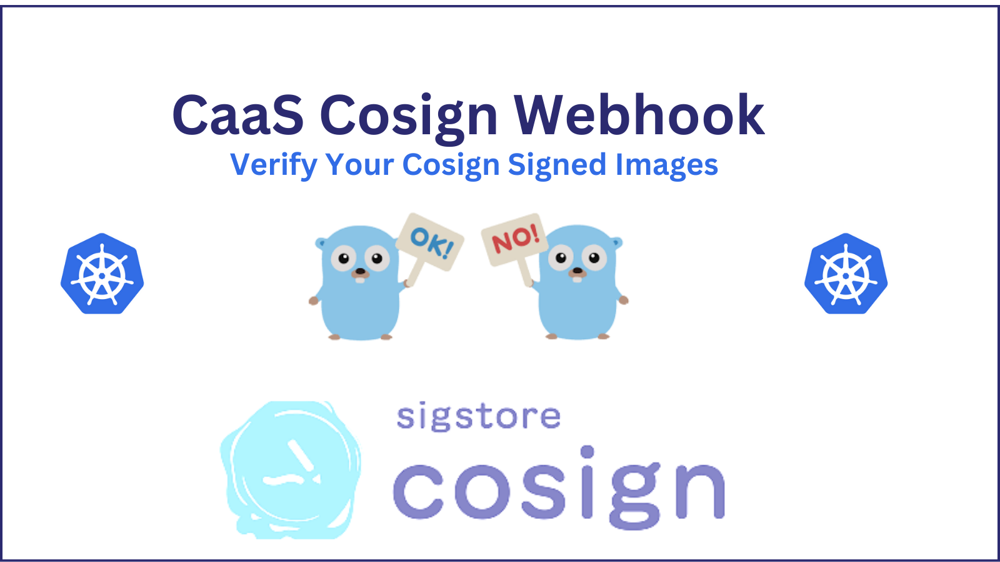

# Cosign Webhook

Kubernetes Validation Admission Controller to verify Cosign Image signatures.



This webhook watches for pod creation in deployments and verifies the first container image it finds with an existing
RSA public key (if present).

# Installation with Helm

```bash
helm -n cosignwebhook upgrade -i cosignwebhook oci://ghcr.io/eumel8/charts/cosignwebhook --versi
on 3.0.0 --create-namespace
```

this installation has some advantages:

* automatic generation of TLS key pair
* automatic setup of ServiceMonitor and Grafana dashboards

If you use your own image, you'll have to sign it first. Don't forget to change the `cosign.scwebhook.key` value to your
public key, used to sign the image.

# Installation with manifest

As cluster admin, create a namespace and install the admission controller:

```bash
kubectl create namespace cosignwebhook
kubectl -n cosignwebhook apply -f manifests/rbac.yaml
kubectl -n cosignwebhook apply -f manifests/manifest.yaml
```

## Cert generation

```bash
generate-certs.sh --service cosignwebhook --webhook cosignwebhook --namespace cosignwebhook --secret cosignwebhook
```

# Usage

To use the webhook, you need to first sign your images with cosign, and then use **one** of the following validation
possibilities:

## Public key as environment variable

Add your Cosign public key as env var in container spec of the first container:

```yaml
        env:
          - name: COSIGNPUBKEY
            value: |
              -----BEGIN PUBLIC KEY-----
              MFkwEwYHKoZIzj0CAQYIKoZIzj0DAQcDQgAEGOrnlJ1lFxAFTY2LF1vCuVHNZr9H
              QryRDinn+JhPrDYR2wqCP+BUkeWja+RWrRdmskA0AffxBzaQrN/SwZI6fA==
              -----END PUBLIC KEY-----
```

## Public key as secret reference

Instead of hardcoding the public key in the deployment, you can also use a secret reference. The key and the secret may
be named freely, as long as the secret contains a valid public key.

```yaml
apiVersion: v1
kind: Secret
data:
  COSIGNPUBKEY: LS0tLS1CRUdJTiBQVUJMSUMgS0VZLS0tLS0KTUZrd0V3WUhLb1pJemowQ0FRWUlLb1pJemowREFRY0RRZ0FFS1BhWUhnZEVEQ3ltcGx5emlIdkJ5UjNxRkhZdgppaWxlMCtFMEtzVzFqWkhJa1p4UWN3aGsySjNqSm5VdTdmcjcrd05DeENkVEdYQmhBSTJveE1LbWx3PT0KLS0tLS1FTkQgUFVCTElDIEtFWS0tLS0t
metadata:
  name: cosignwebhook
type: Opaque
```

```yaml
        env:
          - name: COSIGNPUBKEY
            valueFrom:
              secretKeyRef:
                name: cosignwebhook
                key: COSIGNPUBKEY
```

## Public key as default secret for namespace

Create a default secret for all your images in a namespace, which the webhook will always search for, when validating
images in this namespace:

```yaml
apiVersion: v1
kind: Secret
data:
  COSIGNPUBKEY: LS0tLS1CRUdJTiBQVUJMSUMgS0VZLS0tLS0KTUZrd0V3WUhLb1pJemowQ0FRWUlLb1pJemowREFRY0RRZ0FFS1BhWUhnZEVEQ3ltcGx5emlIdkJ5UjNxRkhZdgppaWxlMCtFMEtzVzFqWkhJa1p4UWN3aGsySjNqSm5VdTdmcjcrd05DeENkVEdYQmhBSTJveE1LbWx3PT0KLS0tLS1FTkQgUFVCTElDIEtFWS0tLS0t
metadata:
  name: cosignwebhook
type: Opaque
```

The name of the secret must be `cosignwebhook` and the key `COSIGNPUBKEY`. The value of `COSIGNPUBKEY` must match the
public key used to sign the image you're deploying.

# Test

Based on the signed image and the corresponding key, the demo app should appear or denied (check event log)

```bash
kubectl create namespace cosignwebhook
kubectl -n cosignwebhook apply -f manifests/demoapp.yaml
```

# TODO

* [x] Support private images
* [x] Support multiple container/keys

# Local build

```bash
CGO_ENABLED=0 GOOS=linux go build -a -ldflags '-extldflags "-static"' -o cosignwebhook
```

## Credits

Frank Kloeker f.kloeker@telekom.de

Life is for sharing. If you have an issue with the code or want to improve it, feel free to open an issue or an pull
request.

The Operator is inspired by [@pipo02mix](https://github.com/pipo02mix/grumpy), a good place
to learn fundamental things about Admission Controllert
